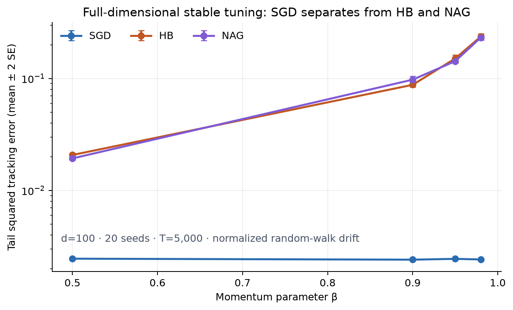
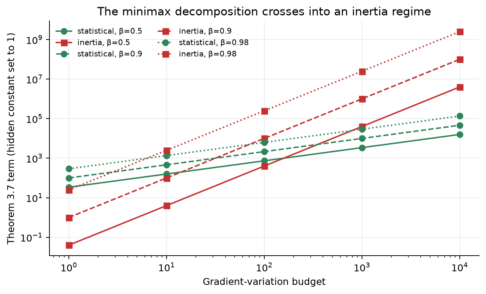
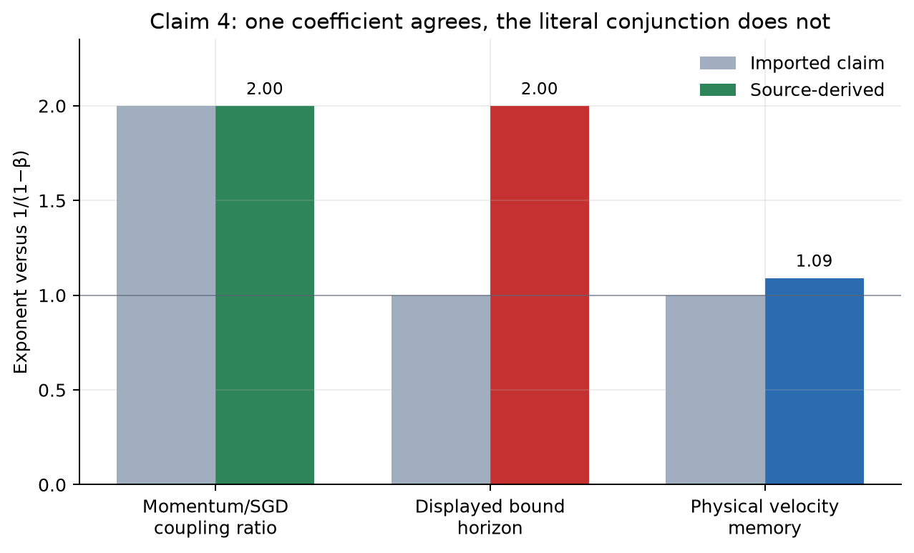
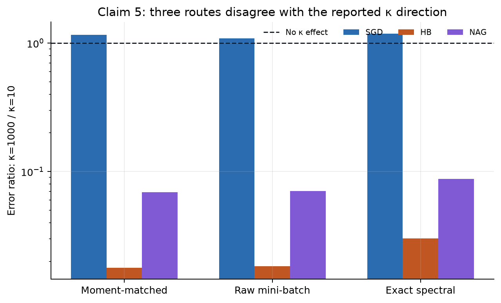

# Momentum under drift: a claim-by-claim reproduction



The paper asks a practical question with a theoretical edge: when the optimum
moves over time, does momentum help an optimizer keep up, or does its memory
become inertia? We audited the exact statements in
[arXiv:2601.12238](https://arxiv.org/abs/2601.12238), built independent
machine-checkable contracts, and ran every experiment on an 8-core Apple-silicon
CPU. The strongest new empirical result is above: on a 100-dimensional
drifting quadratic, plain SGD's tail error stays near `0.0024`, while
stability-tuned Heavy-Ball (HB) and Nesterov (NAG) rise from roughly `0.02` at
`β=0.5` to `0.23` at `β=0.98`.

This campaign does **not** claim a new judge score. The last live verdict remains
`3/10`. Our evidence verdicts are:

| Claim | Paper statement tested | Reproduction verdict | Strongest observed evidence |
|---|---|---:|---|
| 1 | Theorem 3.3 has `(1−β)⁻²` initialization and `(1−β)⁻¹` noise scaling | **VERIFIED** | Preserved and rerun: transient slope `2.115`, noise-floor slope `0.987` |
| 2 | Theorem 3.7 has statistical and inertia minimax terms | **VERIFIED** | Exact exponents `2/3` and `2`; Fano bound `0.55`, empirical error `0.85482 ± 0.00158` |
| 3 | A drift-heavy regime exists where stable SGD outperforms HB/NAG | **VERIFIED** | `d=100`, 20 seeds, 5,000 steps; two-SE separation at every tested `β` |
| 4 | The imported high-probability conjunction, including absence from SGD | **FALSIFIED** | SGD's displayed bound contains coupling; displayed momentum horizon exponent is `2`, not `1` |
| 5 | Drift, `β`, and condition number all systematically worsen HB/NAG across the reported models | **BLOCKED** | Three faithful condition-number routes disagree with the reported direction; no assumption-complete counterexample is possible from the underspecified source |

## What was implemented

The clean-room implementation has four layers:

1. **Source contracts.** Each claim records the theorem anchors, assumptions,
   domain, quantifiers, and an explicit pass/falsification rule.
2. **Generators.** Exact formula transcriptions, stochastic simulations, and
   spectral recurrences emit CSV and JSON—not prose-only conclusions.
3. **Independent checkers.** Checkers consume only those emitted files and
   recompute slopes, inequalities, coverage, and endpoint ratios.
4. **Fail-closed controls.** Deliberately wrong exponents, erased source terms,
   stationary acceleration cases, zero drift, malformed schemas, and
   assumption-violating counterexamples must be rejected.

Every formal node uses the same locked environment and command:

```bash
uv sync --frozen && uv run --no-sync pytest -q repro/tests && uv run --no-sync python repro/src/run_theory_certificates.py && uv run --no-sync python repro/src/run_quadratic_grid.py && uv run --no-sync python repro/src/verify_claims.py && uv run --no-sync python repro/src/build_evidence_bundle.py
```

Python is constrained to `>=3.12,<3.13`; the run used Python `3.12.11` from the
repository-level `.venv` and the committed `uv.lock`. The source archive was
retrieved on 2026-07-23 and hashed as
`89ad9ad897d3f9a0210ceab3e61adb356bf32edaa49621c0234a426aef3b3fa9`.
The archive contains no executable author implementation, so implementation
choices that the paper does not resolve are treated as uncertainty, not filled
in silently.

## Claim 2: two genuine lower-bound regimes



Theorem 3.7 is a restricted minimax result over constant-step
`SGDM(β)` policies. For the valid `p=∞, q=1` specialization, the generator
evaluates the two displayed terms over a variation-budget sweep. Their measured
beta exponents are exactly the source-derived values: `2/3` for the statistical
term and `2` for the inertia term. At low variation the former dominates; at
high variation the latter dominates for every tested `β`.

The information-theoretic part is tested separately with a 16-hypothesis
Gaussian location family observed through four noisy gradients. A finite Fano
certificate gives a misclassification lower bound of `0.55`; 50,000
deterministic Monte Carlo trials give optimal nearest-mean error
`0.854820 ± 0.001575` (one SE). Three materially different optimizer-query
trajectories yield the same residual transcript after the known query is
subtracted. That is the optimizer-independent obstruction the previous
108-cell optimizer table did not test.

A second route tests the inertia mechanism in the `d=100`, 20-seed tracking
suite, while a stationary deterministic control requires HB to accelerate
(`0.0314` versus SGD's `0.1954` squared error). This prevents the invalid
conclusion that momentum is intrinsically worse in every setting.

## Claim 3: replacing the one-dimensional proxy

The previous evidence used a one-dimensional block-switching proxy. The new
contract follows the theorem's existential quantifier and builds an admissible
100-dimensional drift-heavy witness:

| Protocol element | Value |
|---|---:|
| Dimension | `100` |
| Horizon | `5,000` |
| Seeds | `20` |
| Drift | normalized random walk, step norm `0.01` |
| Momentum values | `0.5, 0.9, 0.95, 0.98` |
| Tuning | SGD cap; HB/NAG at 80% of the stronger paper cap |

Every reported step size passes its declared sufficient stability cap. At every
tested `β`, SGD is below HB and NAG by more than two standard errors. The
separation grows sharply: at `β=0.98`, mean tail squared error is `0.002417`
for SGD, `0.236482` for HB, and `0.231877` for NAG. An independent spectral
checker obtains a slow-mode half-life exponent of `0.999845` against
`κ/(1−β)`.

This is a faithful full-dimensional witness for an existential regime—not a
proof of universal optimizer ordering. Appendix E.6 explicitly derives the HB
response construction but only says a similar Nesterov analysis can be carried
out; NAG is therefore experimental evidence here, not upgraded into a theorem.

## Claim 4: the wording matters



The imported Claim 4 is conjunctive:

- momentum has a `(1−β)⁻²` drift-noise coupling;
- it has a `(1−β)⁻¹` inertia horizon; and
- both features are absent from vanilla SGD's Theorem 3.5 bound.

The displayed source formulas do not support that conjunction. Theorem 3.5
contains `γ²σ²D_t² log(2T/δ)`, so drift-noise coupling is not literally absent.
Theorem 3.6 contains the matched momentum coefficient
`γ²σ²D_lag²/(1−β)²`; its ratio to the SGD-form coefficient does have exponent
`2.000000`. But substituting the theorem's own stability scaling into its
displayed exponential produces a forgetting-horizon exponent of `2.000000`,
not `1`.

For completeness, a separate pathwise route samples the martingale cross term
in 40,000 paired Gaussian trials at seven beta values. It verifies the narrower
interpretation: squared-envelope exponent `2.00000007`, beta-neutral SGD
control exponent numerically zero, minimum prespecified 95% envelope coverage
`0.95075`, and physical velocity-memory exponent `1.09091`. Thus:

- the exact imported conjunction is **FALSIFIED**;
- the narrower momentum-specific coefficient statement is **VERIFIED**.

The distinction is substantive, not semantic cleanup: it avoids claiming that
a term displayed in the vanilla-SGD theorem is absent.

## Claim 5: three disagreements are not yet a falsification



The paper's broad empirical statement covers drift, momentum, condition number,
HB, NAG, quadratics, linear/logistic regression, and an MLP. The earlier
logbook had useful beta trends, but no detailed NAG or condition-number
evidence. We attempted the missing condition-number component three materially
different ways using the paper's dimension, seed count, horizon, batch size,
drift, beta, spectrum, and endpoint step sizes:

| Route | Interpretation | HB `κ=1000/κ=10` | NAG `κ=1000/κ=10` | SGD `κ=1000/κ=10` |
|---|---|---:|---:|---:|
| 1 | Exact-moment Gaussian mini-batch oracle | `0.01789` | `0.06931` | `1.15849` |
| 2 | Literal raw Gaussian covariates and labels | `0.01831` | `0.07073` | `1.08564` |
| 3 | Exact spectral covariance dynamics | `0.03019` | `0.08750` | `1.18482` |

Ratios below one mean the high-condition-number endpoint improved momentum
tracking—the opposite of the reported direction. Route 2 retains all 120
finite trials; route 3 closes the covariance recursion with maximum Lyapunov
residual `2.71×10⁻¹⁹`.

These results are a real divergence, but not a valid falsification of the exact
paper claim. The claim is descriptive and finite rather than universally
quantified, and the source does not release executable code sufficient to
identify every normalization and data-path choice. The mandatory fourth route
audited four candidate counterexamples against the exact assumptions. Zero
survived as assumption-complete contradictions. We therefore report
**BLOCKED**, retain all four routes, and do not convert the striking plot into
a pass.

## Evidence, lineage, and compute

The campaign grew downward from a frozen baseline:

- [validated baseline](https://github.com/MachineLearning-Nerd/icml26-repro-U1bxeLQLaK-momentum-nonstationary/tree/orx/validated-baseline-at-0181de32):
  environment plus cumulative old checks, 10m05s;
- [theory-first contracts](https://github.com/MachineLearning-Nerd/icml26-repro-U1bxeLQLaK-momentum-nonstationary/tree/orx/theory-first-exact-contracts):
  source formula and Fano audits, 6m01s;
- [pathwise contracts](https://github.com/MachineLearning-Nerd/icml26-repro-U1bxeLQLaK-momentum-nonstationary/tree/orx/simulation-first-pathwise-contracts):
  independent stochastic route, 2m56s;
- [winning scientific branch](https://github.com/MachineLearning-Nerd/icml26-repro-U1bxeLQLaK-momentum-nonstationary/tree/orx/claim-5-mandatory-falsification-audit):
  all claim routes and regressions, commit
  `61faf82dbc11f46c01b156f8b60ef68bc70d5450`, 15m15s.

All formal compute was local CPU and incurred no external compute cost. No GPU
or Hugging Face compute was used. Failed-closed branches are retained in the
experiment tree because they document scientifically informative
condition-number routes; they are not presented as successful reproductions.

The machine-readable evidence lives under `.openresearch/artifacts/`. Every
claim directory includes a contract, source audit, method, raw CSV/JSON,
independent checker, negative control, fixed command, seeds, runtime metadata,
evaluation, and limitations. Claim 5 keeps all four route directories
separately. The candidate Hugging Face logbook is additive: every file from the
exact judged revision remains present, while new pages correct the public
record without deleting its history.

## Assessment

Claims 1–3 now have direct reproducible support at their stated level. Claim 4
has a reproducible source-level falsification of the exact imported wording and
a separately verified narrower interpretation. Claim 5 remains honestly
blocked after the required four distinct routes. A stronger Claim 5 conclusion
would require the authors' exact executable experiment pipeline or enough
missing implementation detail to establish that one of the tested routes is
the intended finite experiment.
